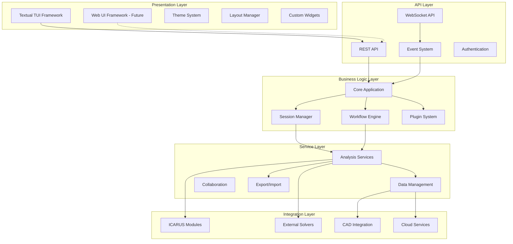

# Design Document

## Overview

The ICARUS CLI Revamp will create a next-generation terminal user interface that transforms how users interact with ICARUS aerodynamics software. Built on Textual framework, the new CLI will provide a modern, intuitive, and powerful interface that serves both newcomers learning aircraft design and experienced engineers performing complex analyses.

The design emphasizes modularity, extensibility, and user experience, creating a unified platform that integrates all ICARUS capabilities while maintaining the flexibility to grow with user needs and technological advances.

## Architecture

### High-Level Architecture (Web-Migration Ready)



### Core Components

#### 1. Application Framework (`app/`)
- **Main Application**: Central TUI application controller
- **Screen Manager**: Handles screen transitions and navigation
- **Event System**: Manages inter-component communication
- **State Manager**: Maintains application and session state

#### 2. User Interface (`ui/`)
- **Screen Components**: Main application screens (Dashboard, Analysis, Results, etc.)
- **Widget Library**: Reusable UI components specific to aerospace applications
- **Theme System**: Comprehensive theming with aerospace-focused designs
- **Layout Engine**: Responsive layout management for different terminal sizes

#### 3. Analysis Engine (`analysis/`)
- **Module Integrations**: Interfaces to all ICARUS analysis modules
- **Solver Management**: Unified interface to external solvers
- **Parameter Validation**: Comprehensive input validation and error handling
- **Result Processing**: Standardized result handling and formatting

#### 4. Workflow System (`workflow/`)
- **Visual Workflow Builder**: Drag-and-drop workflow creation
- **Template Library**: Pre-built workflow templates for common tasks
- **Execution Engine**: Robust workflow execution with error recovery
- **Progress Tracking**: Real-time progress monitoring and reporting

#### 5. Data Management (`data/`)
- **Database Layer**: Structured storage for analyses, results, and configurations
- **Import/Export**: Multi-format data exchange capabilities
- **Visualization**: Interactive plotting and chart generation
- **Version Control**: Track changes and maintain analysis history

#### 6. Collaboration (`collaboration/`)
- **Session Sharing**: Real-time collaborative analysis sessions
- **User Management**: Role-based access control and permissions
- **Synchronization**: State synchronization across multiple users
- **Communication**: Built-in chat and annotation system

#### 7. Plugin System (`plugins/`)
- **Plugin API**: Well-defined interface for extending functionality
- **Discovery**: Automatic plugin detection and loading
- **Management**: Plugin installation, updates, and dependency resolution
- **Sandboxing**: Secure plugin execution environment

## Components and Interfaces

### Core Application Interface

```python
class IcarusCLI:
    """Main application controller"""

    def __init__(self):
        self.screen_manager: ScreenManager
        self.session_manager: SessionManager
        self.workflow_engine: WorkflowEngine
        self.plugin_manager: PluginManager

    async def run(self) -> None:
        """Start the application"""

    def register_screen(self, screen: Screen) -> None:
        """Register a new screen"""

    def switch_screen(self, screen_id: str) -> None:
        """Switch to a different screen"""
```

### Analysis Service Interface

```python
class AnalysisService:
    """Unified interface for all analysis types"""

    def get_available_modules(self) -> List[AnalysisModule]:
        """Get all available analysis modules"""

    async def run_analysis(self, config: AnalysisConfig) -> AnalysisResult:
        """Execute an analysis with given configuration"""

    def validate_parameters(self, params: Dict) -> ValidationResult:
        """Validate analysis parameters"""

    def get_solver_info(self, solver_name: str) -> SolverInfo:
        """Get information about a specific solver"""
```

### Workflow Engine Interface

```python
class WorkflowEngine:
    """Manages workflow creation and execution"""

    def create_workflow(self, template: WorkflowTemplate) -> Workflow:
        """Create a new workflow from template"""

    async def execute_workflow(self, workflow: Workflow) -> WorkflowResult:
        """Execute a workflow with progress tracking"""

    def get_templates(self) -> List[WorkflowTemplate]:
        """Get available workflow templates"""

    def save_workflow(self, workflow: Workflow) -> None:
        """Save a workflow for reuse"""
```

### Plugin System Interface

```python
class PluginManager:
    """Manages plugin lifecycle and integration"""

    def discover_plugins(self) -> List[Plugin]:
        """Discover available plugins"""

    def load_plugin(self, plugin_id: str) -> Plugin:
        """Load and initialize a plugin"""

    def get_plugin_api(self) -> PluginAPI:
        """Get the plugin development API"""

    def validate_plugin(self, plugin: Plugin) -> ValidationResult:
        """Validate plugin compatibility and security"""
```

## Data Models

### Analysis Configuration

```python
@dataclass
class AnalysisConfig:
    """Configuration for an analysis run"""
    analysis_type: AnalysisType
    target: str  # Airfoil name, airplane file, etc.
    solver: str
    parameters: Dict[str, Any]
    output_format: str
    metadata: Dict[str, Any]
```

### Workflow Definition

```python
@dataclass
class WorkflowStep:
    """Individual step in a workflow"""
    id: str
    name: str
    analysis_config: AnalysisConfig
    dependencies: List[str]
    conditions: List[Condition]

@dataclass
class Workflow:
    """Complete workflow definition"""
    id: str
    name: str
    description: str
    steps: List[WorkflowStep]
    metadata: Dict[str, Any]
```

### Session State

```python
@dataclass
class SessionState:
    """Current application session state"""
    user_id: str
    workspace: str
    active_analyses: List[str]
    recent_results: List[str]
    preferences: UserPreferences
    collaboration_session: Optional[str]
```

## Error Handling

### Error Classification

1. **User Input Errors**: Invalid parameters, missing files, etc.
2. **System Errors**: Solver failures, memory issues, etc.
3. **Network Errors**: Collaboration or cloud service failures
4. **Plugin Errors**: Plugin crashes or compatibility issues

### Error Recovery Strategy

```python
class ErrorHandler:
    """Centralized error handling and recovery"""

    def handle_error(self, error: Exception, context: ErrorContext) -> ErrorResponse:
        """Handle errors with appropriate recovery strategies"""

    def suggest_solutions(self, error: Exception) -> List[Solution]:
        """Provide user-friendly solution suggestions"""

    def log_error(self, error: Exception, context: ErrorContext) -> None:
        """Log errors for debugging and analytics"""
```

### Graceful Degradation

- **Offline Mode**: Core functionality available without network
- **Reduced Feature Set**: Disable advanced features if dependencies unavailable
- **Alternative Solvers**: Automatic fallback to available solvers
- **Safe Mode**: Minimal interface for troubleshooting

## Testing Strategy

### Unit Testing
- **Component Isolation**: Test each component independently
- **Mock Dependencies**: Use mocks for external services and solvers
- **Edge Cases**: Comprehensive testing of error conditions
- **Performance**: Benchmark critical operations

### Integration Testing
- **End-to-End Workflows**: Test complete analysis workflows
- **Solver Integration**: Verify integration with all supported solvers
- **Data Flow**: Test data flow between components
- **Plugin Compatibility**: Test plugin loading and execution

### User Experience Testing
- **Usability Testing**: Test with real users performing typical tasks
- **Accessibility**: Ensure interface works with screen readers and assistive technology
- **Performance Testing**: Test responsiveness under various loads
- **Cross-Platform**: Test on different operating systems and terminal emulators

### Automated Testing Pipeline

```yaml
# CI/CD Pipeline
stages:
  - lint_and_format
  - unit_tests
  - integration_tests
  - performance_tests
  - security_scan
  - user_acceptance_tests
  - deployment
```

## Implementation Phases

### Phase 1: Core Framework (Weeks 1-4)
- Basic Textual application structure
- Screen management and navigation
- Theme system and basic widgets
- Session management
- Configuration system

### Phase 2: Analysis Integration (Weeks 5-8)
- ICARUS module integration
- Solver interfaces
- Parameter validation
- Basic result display
- Error handling

### Phase 3: Advanced Features (Weeks 9-12)
- Workflow system
- Data management and visualization
- Export/import capabilities
- Plugin system foundation
- Performance optimization

### Phase 4: Collaboration and Polish (Weeks 13-16)
- Collaboration features
- Advanced visualizations
- Documentation and tutorials
- User testing and refinement
- Final optimization and deployment

## Security Considerations

### Data Protection
- **Encryption**: Encrypt sensitive data at rest and in transit
- **Access Control**: Role-based permissions for collaborative features
- **Audit Logging**: Track all user actions for security monitoring
- **Data Sanitization**: Validate and sanitize all user inputs

### Plugin Security
- **Sandboxing**: Execute plugins in isolated environments
- **Code Signing**: Verify plugin authenticity and integrity
- **Permission System**: Granular permissions for plugin capabilities
- **Security Scanning**: Automated vulnerability scanning for plugins

### Network Security
- **TLS Encryption**: Secure all network communications
- **Authentication**: Strong authentication for cloud services
- **Rate Limiting**: Prevent abuse of network resources
- **VPN Support**: Support for corporate VPN environments

## Performance Requirements

### Response Time Targets
- **UI Interactions**: < 100ms for immediate feedback
- **Screen Transitions**: < 200ms for smooth navigation
- **Analysis Startup**: < 2 seconds for parameter validation
- **Result Display**: < 1 second for typical result sets

### Resource Usage
- **Memory**: < 500MB baseline, scalable based on data size
- **CPU**: Efficient use of available cores for parallel processing
- **Storage**: Intelligent caching with configurable limits
- **Network**: Minimal bandwidth usage with compression

### Scalability
- **Concurrent Users**: Support 10+ users in collaboration mode
- **Large Datasets**: Handle datasets up to 1GB efficiently
- **Long-Running Analyses**: Support analyses running for hours/days
- **Plugin Ecosystem**: Support 50+ plugins without performance degradation

## Web Application Migration Readiness

### Architecture Separation

The system is designed with clear separation between presentation, business logic, and data layers to enable seamless migration to web technologies:

#### API-First Design
- **REST API Layer**: All business logic accessible via RESTful endpoints
- **WebSocket Support**: Real-time features implemented with WebSocket protocols
- **Stateless Services**: Core services designed to be stateless and scalable
- **Standard Serialization**: JSON-based data exchange compatible with web frameworks

#### UI Abstraction
```python
class UIAdapter:
    """Abstract interface for different UI implementations"""

    def render_screen(self, screen_data: ScreenData) -> None:
        """Render a screen with given data"""

    def handle_user_input(self, input_event: InputEvent) -> None:
        """Handle user input events"""

    def update_component(self, component_id: str, data: Any) -> None:
        """Update a specific UI component"""

class TextualUIAdapter(UIAdapter):
    """Textual-specific UI implementation"""
    pass

class WebUIAdapter(UIAdapter):
    """Future web UI implementation"""
    pass
```

#### Data Model Compatibility
- **JSON Serializable**: All data models support JSON serialization
- **Schema Validation**: OpenAPI/JSON Schema definitions for all APIs
- **Version Compatibility**: API versioning to support multiple client types
- **Cross-Platform Types**: Use of standard data types compatible with web technologies

### Migration Strategy

#### Phase 1: API Development
- Implement REST API layer alongside TUI
- Create OpenAPI specifications
- Develop authentication system compatible with web standards
- Test API endpoints with automated tools

#### Phase 2: Frontend Framework Selection
- Evaluate modern web frameworks (React, Vue, Svelte)
- Create proof-of-concept web interface
- Implement core screens in web technology
- Establish design system translation

#### Phase 3: Feature Parity
- Migrate all TUI features to web interface
- Implement real-time collaboration via WebSocket
- Add web-specific enhancements (responsive design, mobile support)
- Performance optimization for web deployment

#### Phase 4: Deployment Options
- Support both TUI and web interfaces simultaneously
- Cloud deployment with container orchestration
- Progressive Web App (PWA) capabilities
- Offline functionality for web version

### Technology Compatibility Matrix

| Component | TUI Technology | Web Technology | Shared Code % |
|-----------|---------------|----------------|---------------|
| Business Logic | Python Classes | Python/FastAPI | 95% |
| Data Models | Pydantic | Pydantic/JSON Schema | 100% |
| Authentication | Local/LDAP | JWT/OAuth2 | 80% |
| Database | SQLite/PostgreSQL | PostgreSQL/MongoDB | 90% |
| Real-time Features | Asyncio | WebSocket/SSE | 85% |
| File Processing | Python Libraries | Same Libraries | 100% |
| Visualization | Rich/Matplotlib | D3.js/Plotly.js | 60% |

### Benefits of Migration-Ready Design

1. **Reduced Development Time**: Reuse of 80%+ business logic
2. **Consistent Behavior**: Same core functionality across interfaces
3. **Easier Maintenance**: Single source of truth for business rules
4. **Flexible Deployment**: Support multiple interface types simultaneously
5. **Future-Proof**: Easy adoption of new UI technologies
