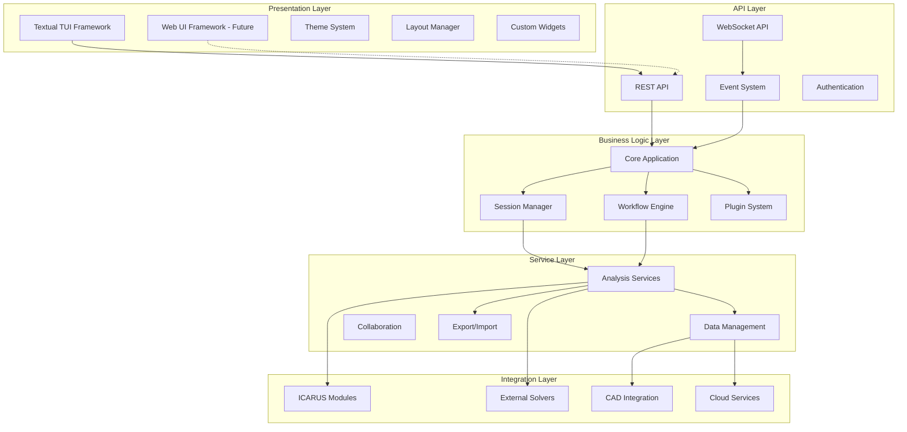
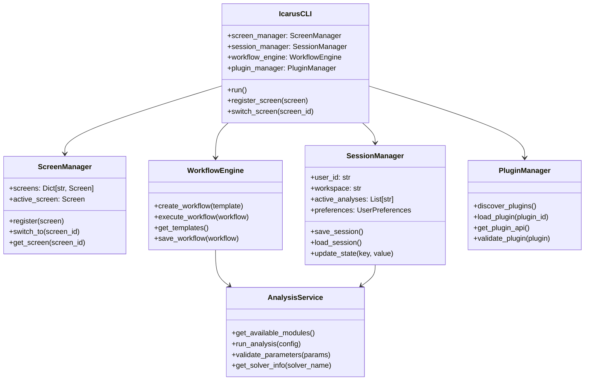
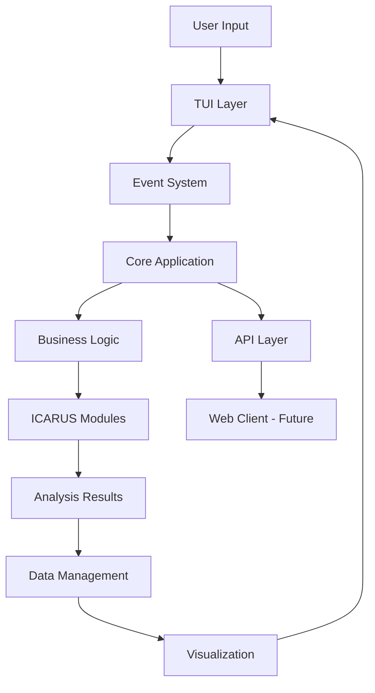
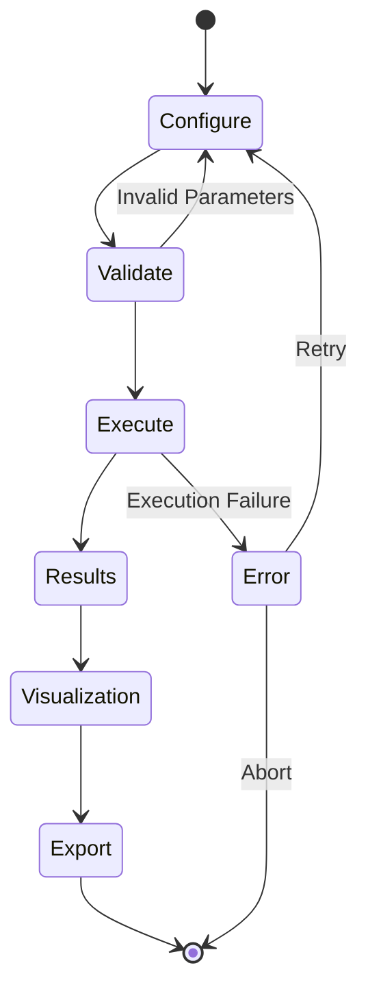
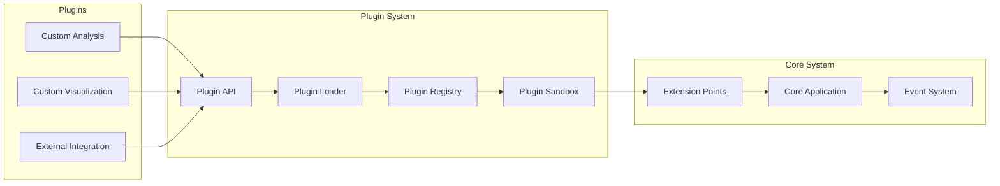
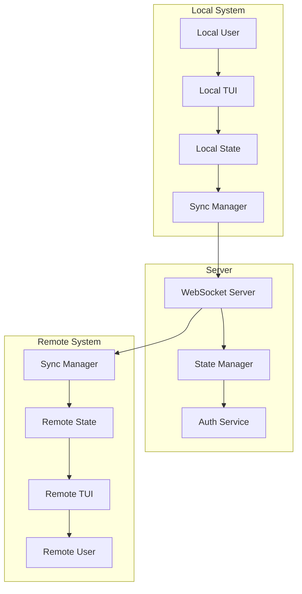

# ICARUS CLI Architecture

This document provides a visual representation of the ICARUS CLI architecture.

## High-Level Architecture

## Component Relationships

## Data Flow

## Workflow System

## Plugin System

## Collaboration System

