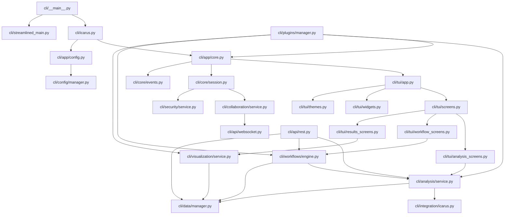
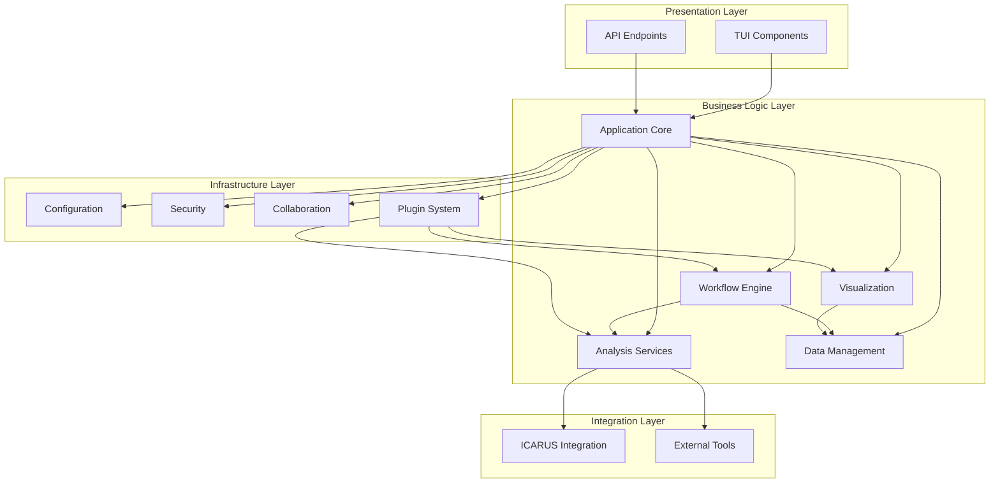
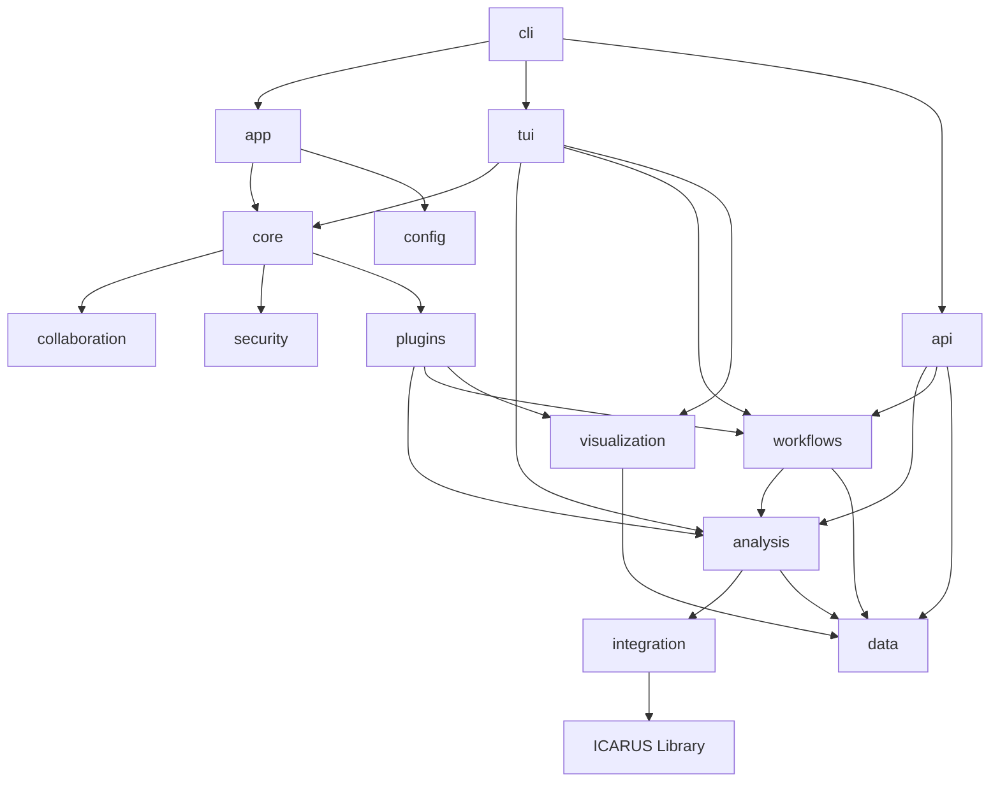
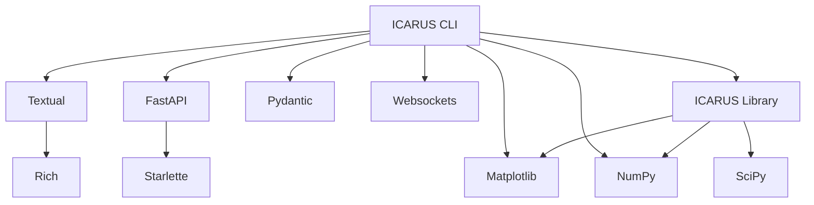

# ICARUS CLI Module Dependencies

This document visualizes the dependencies between the major modules of the ICARUS CLI system.

## Module Dependency Graph

## Layer Dependencies

## Package Dependencies

## External Dependencies

