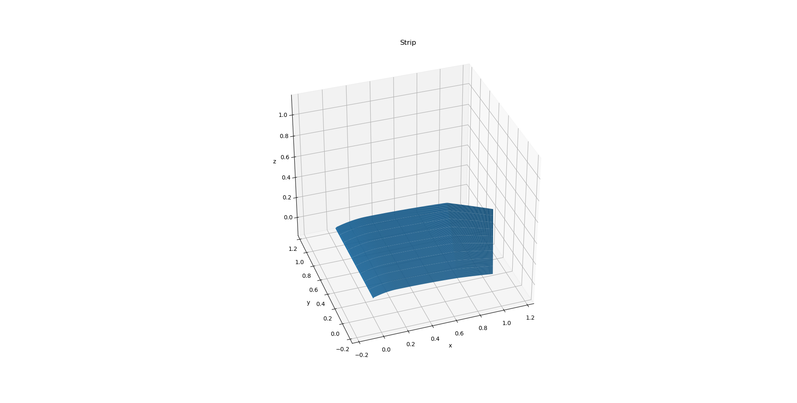

ICARUS.Vehicle package
======================

The Vehicle package contains the classes that define different vehicle geometries.

Strip module
---------------------------

.. toctree::
   :maxdepth: 2

   strip

The most simple vehicle geometry we can define is a wing strip. A wing strip is a section of a wing defined by a start and end section. A section, in that sense, is a stretched and rotated airfoil. The Strip class is iniitialized as follows:

.. literalinclude:: ../../../../ICARUS/Vehicle/strip.py
    :pyobject: Strip.__init__

The Strip class can interpolate the geometry of any section in between the start and end section. The interpolation is done by linearly interpolating the airfoil shape and the chord. In future versions of we must include orientation interpolation to account for twist and dihedral.

.. literalinclude:: ../../../../ICARUS/Vehicle/strip.py
    :pyobject: Strip.get_interpolated_section

To understand this further we can define two airfoils and create a strip by interpolating between them.

.. code-block:: python

    import numpy as np
    from ICARUS.Vehicle.strip import Strip
    from ICARUS.Vehicle.airfoil import Airfoil

    # Define two airfoils
    airfoil = Airfoil.naca('2412')
    airfoil_flapped = airfoil_1.flap_airfoil(0.7 , 1.3, 30)

    # Define a strip
    my_strip = Strip(
        start_airfoil= airfoil,
        end_airfoil= airfoil_flapped,
        start_chord= 1.,
        end_chord= 1.4,
        start_leading_edge= [0., 0., 0.],
        end_leading_edge= [0., 1., 0.],
    )

    # We can now plot the strip which will automatically interpolate 20 sections
    my_strip.plot()

Wing Segment module
-----------------------------------

.. toctree::
   :maxdepth: 2

   wing_segment

Another way to define model a part of a wing is by using a WingSegment. A WingSegment is defined as follows:

.. literalinclude:: ../../../../ICARUS/Vehicle/wing_segment.py
    :pyobject: Wing_Segment.__init__

A wing segment is defined by specifying the following parameters:

1) The name of the wing segment
2) The airfoil of the wing segment
3) The origin of the wing segment
4) The orientation of the wing segment
5) Whether the wing segment is symmetric or not, i.e. if the wing segment is mirrored along the x-axis
6) The span of the wing segment
7) The sweep offset of the wing segment
8) The dihedral angle of the wing segment
9) The chord function used to descritize the wing segment
10) The start and end chord of the wing segment
11) The span function used to descritize the wing segment
12) The number of chordwise elements
13) The number of spanwise elements
14) The mass of the wing segment

Then in the above example the __init__ function creates the discretization, the grid and the panels, calculates the area and volume and finds the center of gravity and the inertia tensor by assuming a uniform volumetric mass distribution.

Merged Wing
----------------------------------

.. toctree::
   :maxdepth: 2

   merged_wing

A merged wing is a wing that is composed of multiple wing segments. This class is under development and has not been completed. As of now the Merged_Wing class is initialized as follows:

.. literalinclude:: ../../../../ICARUS/Vehicle/merged_wing.py
    :pyobject: Merged_Wing.__init__

Plane
---------------------------

A plane is a vehicle that is composed of multiple Wing Segments. To define a plane we must specify the following parameters:
1) The name of the plane
2) The wing segments that compose the plane
3) Possible disturbances that act on the plane
4) The orientation of the plane

The Plane class is initialized as follows:

.. literalinclude:: ../../../../ICARUS/Vehicle/plane.py
    :pyobject: Airplane.__init__

Surface Connections module
------------------------------------------

.. .. automodule:: ICARUS.Vehicle.surface_connections
..    :members:
..    :undoc-members:
..    :show-inheritance:
